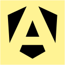
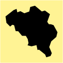
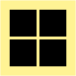
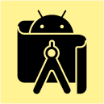
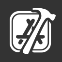

# OVERVIEW

Personal knowledge base containing notes, documentation, and references on programming, tools, algorithms, system design, software engineering practices, and various explorations. Organized for quick reference and continuous updates.

### Development

### Miscellaneous

### System

### Tooling

# GUIDANCE

### Create New Tiles

Here are the instructions to create new tiles:

- Open the <kbd>.assets/mockup.f0</kbd> file.
- Copy and paste the empty rectangle.
- Copy and paste an icon.
- Center the icon to the rectangle.
- Group the icon and rectangle.
- Export the group with <kbd>command</kbd> + <kbd>e</kbd>.
- Copy the file to the <kbd>.assets</kbd> folder.

### Gather New Icons

Here are some websites to download icons:

- https://dashboardicons.com
- https://lobehub.com/icons
- https://simpleicons.org
- https://svglogo.co

