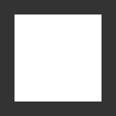
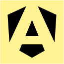

  
  <h1><samp>TECHDOCS</samp></h1>
  
Lorem ipsum dolor sit amet, consectetur adipiscing elit. Suspendisse laoreet pharetra bibendum. Aliquam tincidunt ac velit ac vestibulum. Ut massa ante, sodales pellentesque pharetra porttitor, tincidunt quis nulla.

### Backend

### Frontend

### Mobile

### Tooling

