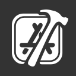
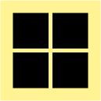

    <picture>
        <source media="(prefers-color-scheme: dark)" srcset=".assets/icon-dark.svg">
        
    </picture>
    <h1><samp>TECHDOCS</samp></h1>
    
Lorem ipsum dolor sit amet, consectetur adipiscing elit. Suspendisse laoreet pharetra bibendum. Aliquam tincidunt ac velit ac vestibulum. Ut massa ante, sodales pellentesque pharetra porttitor, tincidunt quis nulla.

---

<h3 align="center">Backend</h3>

<picture></picture><picture></picture><picture></picture><picture></picture><picture></picture>

---

<h3 align="center">Frontend</h3>

<picture></picture><picture></picture><picture></picture><picture></picture><picture></picture>

---

<h3 align="center">Mobile</h3>

<picture></picture><picture></picture><picture></picture><picture></picture><picture></picture>

---

<h3 align="center">System</h3>

<picture></picture><picture></picture><picture></picture><picture></picture><picture></picture>

---

<h3 align="center">Tooling</h3>

<picture></picture><picture></picture><picture></picture><picture></picture><picture></picture>
